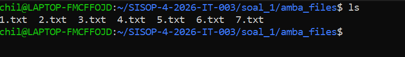
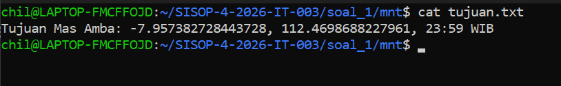

# SISOP-4-2026-IT-003
Praktikum Sistem Operasi Modul 4 - File System - FUSE

Nama : Chilmi Muhammad Ulin Nuha

NRP : 5027251003

## Reporting
### Soal 1 - Save Asisten Kenz

Pada soal ini, kita diminta untuk menyelamatkan Asisten Kenz dengan cara menemukan koordinat rahasia dari Mas Amba. Kita harus membuat sebuah program *Filesystem in Userspace* (FUSE) bernama `kenz_rescue.c`. FUSE ini bertindak sebagai *passthrough* (cermin) dari sebuah direktori sumber (`amba_files`), namun dengan modifikasi untuk menyuntikkan sebuah file virtual (`tujuan.txt`) yang isinya dibangkitkan secara dinamis (*on-the-fly*) dari gabungan file-file sumber tanpa mengubah direktori aslinya sama sekali.

#### Persiapan dan Setup - kenz_rescue.c

Langkah pertama pada program FUSE ini adalah mendefinisikan *header* yang dibutuhkan dan sebuah variabel global untuk menyimpan *absolute path* dari direktori sumber (dalam hal ini direktori `amba_files`). 

```c
#define FUSE_USE_VERSION 31
#include <fuse.h>
#include <stdio.h>
#include <string.h>
#include <unistd.h>
#include <fcntl.h>
#include <dirent.h>
#include <errno.h>
#include <sys/stat.h>
#include <stdlib.h>

char dirpath[1000]; // Menyimpan path asli (source directory)

// Menggabungkan path FUSE dengan path asli
static void get_full_path(char fpath[1000], const char *path) {
    if (strcmp(path, "/") == 0) {
        path = "";
    }
    sprintf(fpath, "%s%s", dirpath, path);
}
```

Sebuah fungsi *helper* `get_full_path` juga dibuat untuk mempermudah translasi direktori (contoh: me-*mapping* akses `/1.txt` di *mount point* menjadi `/path/ke/amba_files/1.txt`).

#### Modifikasi Atribut File (getattr)

Untuk membuat file virtual `tujuan.txt` seolah-olah nyata, kita harus mencegat pemanggilan `getattr`. Jika *user* mencari atribut untuk `/tujuan.txt`, program tidak akan meneruskannya ke direktori asli, melainkan mengembalikan struct stat palsu (*mock stat*) yang mendefinisikan perizinan *read-only* dan ukuran fiktif. 

```c
// === POIN C: Modifikasi Getattr ===
static int xmp_getattr(const char *path, struct stat *stbuf) {
    // Memalsukan keberadaan file virtual tujuan.txt
    memset(stbuf, 0, sizeof(struct stat));

    if (strcmp(path, "/tujuan.txt") == 0) {
        stbuf->st_mode = S_IFREG | 0444; // Read-Only
        stbuf->st_nlink = 1;
        stbuf->st_size = 1024;
        return 0;
    }

    char fpath[1000];
    get_full_path(fpath, path);
    int res = lstat(fpath, stbuf);

    if (res == -1) return -errno;
    return 0;
}
```

#### Injeksi Direktori (readdir)

Agar file virtual tersebut muncul saat perintah `ls` dijalankan di *root mount point*, fungsi `readdir` dimodifikasi. Program akan membaca direktori asli seperti biasa, namun pada akhir fungsi, program menyuntikkan satu entri tambahan bernama `tujuan.txt` menggunakan fungsi `filler`.

```c
// === POIN C: Modifikasi Readdir ===
static int xmp_readdir(const char *path, void *buf, fuse_fill_dir_t filler, off_t offset, struct fuse_file_info *fi) {
    char fpath[1000];
    get_full_path(fpath, path);

    DIR *dp = opendir(fpath);
    if (dp == NULL) return -errno;

    struct dirent *de;
    while ((de = readdir(dp)) != NULL) {
        struct stat st;
        memset(&st, 0, sizeof(st));
        st.st_ino = de->d_ino;
        st.st_mode = de->d_type << 12;
        filler(buf, de->d_name, &st, 0);
    }
    closedir(dp);

    // Menambahkan file virtual tujuan.txt saat ls root
    if (strcmp(path, "/") == 0) {
        filler(buf, "tujuan.txt", NULL, 0);
    }
    return 0;
}
```

#### Manipulasi String On-The-Fly (read)

Ini adalah inti dari penemuan koordinat rahasia. Ketika perintah `cat mnt/tujuan.txt` dijalankan, program tidak membaca dari disk fisik. Program akan melakukan iterasi untuk membuka file `1.txt` hingga `7.txt` secara fisik, mencari baris yang mengandung *substring* `"KOORD:"`, lalu merangkai hasilnya (*concatenate*) ke dalam satu *buffer string* besar yang akhirnya dikembalikan kepada *user*. File selain `tujuan.txt` akan dilewatkan menggunakan operasi `pread` standar.

```c
// === POIN D: Modifikasi Read ===
static int xmp_read(const char *path, char *buf, size_t size, off_t offset, struct fuse_file_info *fi) {
    // Merakit isi tujuan.txt dari file 1.txt - 7.txt
    if (strcmp(path, "/tujuan.txt") == 0) {
        char hasil_akhir[2048] = "Tujuan Mas Amba: ";

        for (int i = 1; i <= 7; i++) {
            char file_target[1050];
            sprintf(file_target, "%s/%d.txt", dirpath, i);
            FILE *fp = fopen(file_target, "r");

            if (fp != NULL) {
                char line[512];
                while (fgets(line, sizeof(line), fp)) {
                    char *koord_ptr = strstr(line, "KOORD:");
                    if (koord_ptr != NULL) {
                        koord_ptr += 6;
                        while (*koord_ptr == ' ') koord_ptr++;
                        koord_ptr[strcspn(koord_ptr, "\r\n")] = 0;
                        strcat(hasil_akhir, koord_ptr);
                        break;
                    }
                }
                fclose(fp);
            }
        }
        strcat(hasil_akhir, "\n");
        size_t len = strlen(hasil_akhir);

        if (offset >= len) return 0;
        if (offset + size > len) size = len - offset;
        
        memcpy(buf, hasil_akhir + offset, size);
        return size;
    }

    // Passthrough read untuk file biasa (1.txt - 7.txt)
    char fpath[1000];
    get_full_path(fpath, path);
    int fd = open(fpath, O_RDONLY);
    if (fd == -1) return -errno;

    int res = pread(fd, buf, size, offset);
    if (res == -1) res = -errno;
    close(fd);
    return res;
}
```

#### Eksekusi Main dan Registrasi Callback

Fungsi `main` digunakan untuk memvalidasi argumen yang di-*passing* melalui terminal. Sesuai soal yang meminta parameter `./kenz_rescue <source_directory> <mount_directory>`, kita menggunakan fungsi `realpath` untuk menyimpan *source* dan menggeser pointer array `argv` agar `fuse_main` dapat mengenali lokasi *mount point* yang diinginkan.

```c
static struct fuse_operations xmp_oper = {
    .getattr = xmp_getattr,
    .readdir = xmp_readdir,
    .read    = xmp_read,
};

int main(int argc, char *argv[]) {
    // Validasi argumen input
    if (argc < 3) {
        printf("Usage: %s <source_dir> <mount_dir>\n", argv[0]);
        return 1;
    }

    // Mengambil absolute path source directory
    realpath(argv[1], dirpath);

    // Menggeser argumen agar FUSE membaca mount_dir
    argv[1] = argv[2];
    argc--;

    // Menjalankan filesystem FUSE
    return fuse_main(argc, argv, &xmp_oper, NULL);
}
```

#### Output

##### Ekstraksi File Zip Amba (Poin A)


##### FUSE Terpasang & File Virtual Muncul (Poin C)


##### Hasil Operasi `cat tujuan.txt` On-The-Fly (Poin D)


### Soal 2 - Poke MOO
